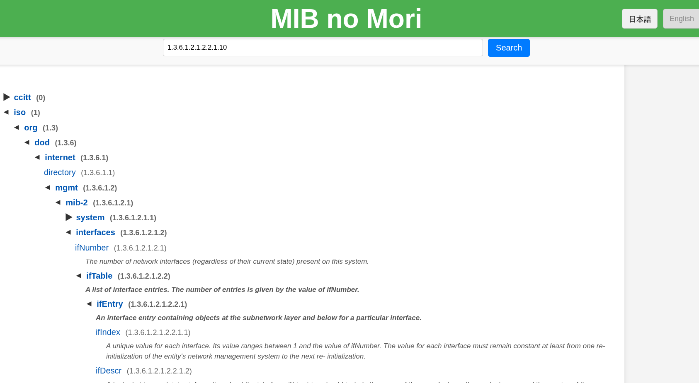
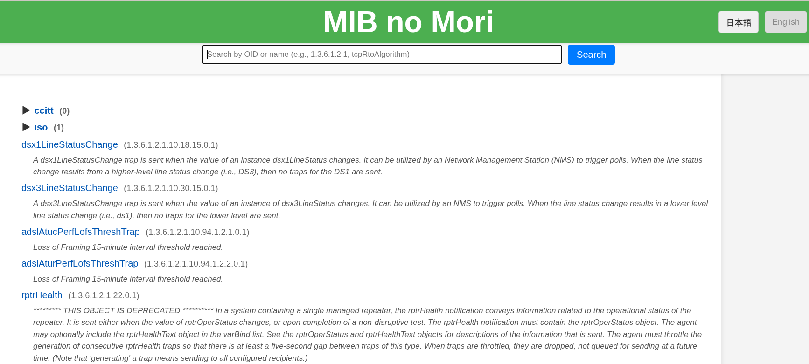
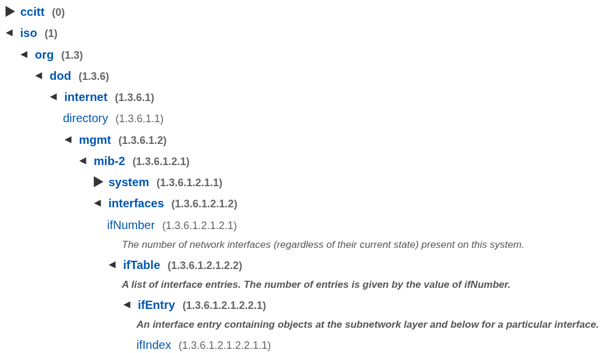
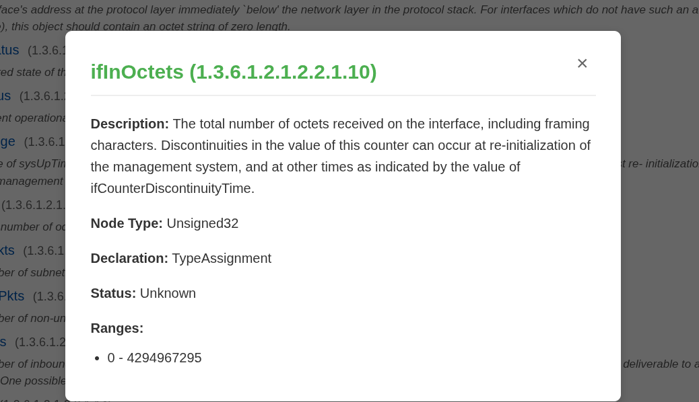
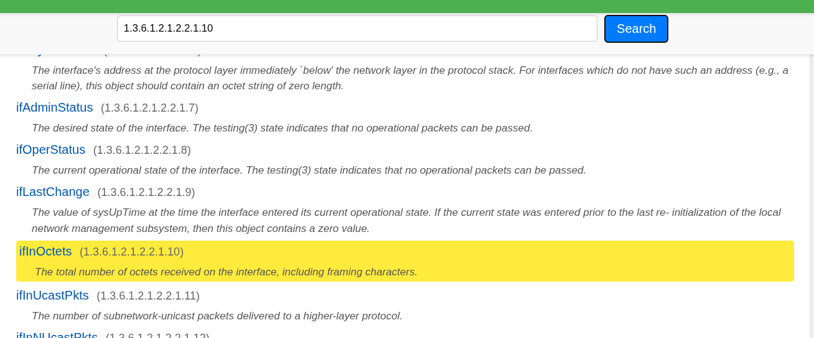
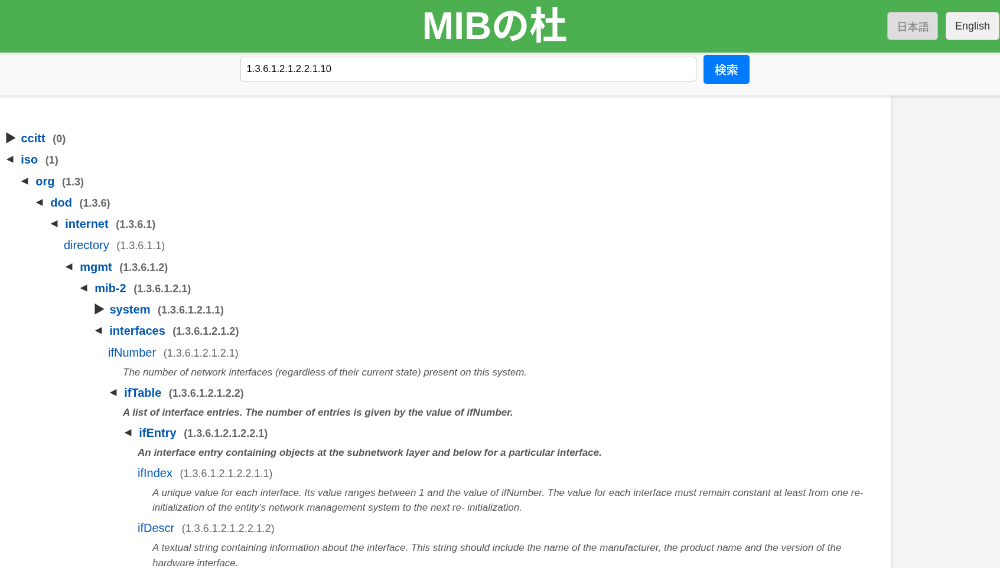
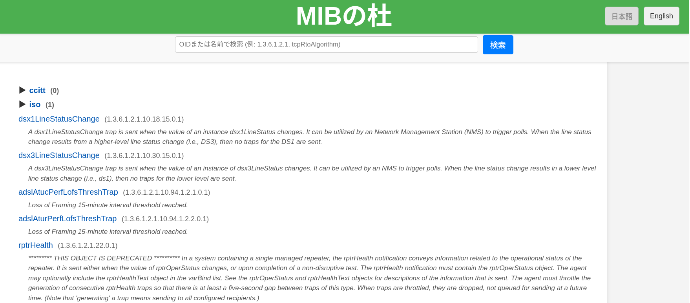
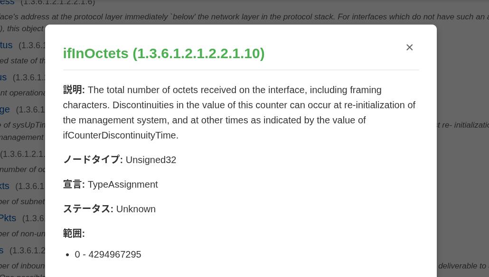
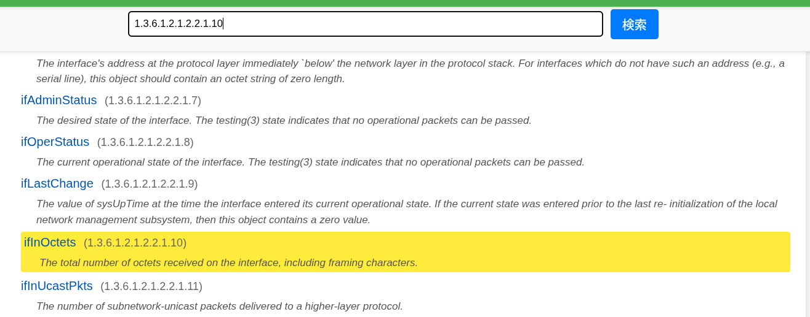

# MIBの杜 (MIB no Mori)

- [日本語](#説明)

## Description

**MIB no Mori** is a web application that displays the SNMP MIB database in a tree view and allows searching by OID or MIB object name.



## Execution Procedure

The application consists of a backend that reads MIB database files and services API, and a frontend that provides UI to a web browser. The backend uses Go and the frontend uses Node.js, and an environment capable of building and running each is required.

### Starting the backend

Place the MIB database files in the `mibs-browser-backend/mibs` folder (subfolders are not available). MIB database files can be downloaded, for example, in a Debian GNU/Linux environment, from libsnmp-base package and snmp-mibs-downloader package will be placed in the folders `/usr/share/snmp/mibs`, `/var/lib/mibs/iana` and `/var/lib/mibs/ietf`, so you can copy the files in these folders to `mibs-browser-backend/mibs`.

If necessary, download the vendor-specific MIB database file and copy it as well.

After installing the [Go release](https://go.dev/dl/), start the backend server in the `mibs-browser-backend` folder as follows:

```
go run main.go
```

- Running `go build` will create an executable called `mib-browser-backend` (it can be built with `CGO_ENABLED=0` since it is Pure Go). If you don't want to run on a host with Go releases, use the generated executable.
- By default, the backend server is started on TCP port 5000. You can change it to any other port with the `PORT` environment variable.
- By default, CORS is set assuming that the frontend server is started at `http://localhost:5173`. If you want a different configuration, specify the URL of the frontend server in the environment variable `FRONTEND_ORIGINS`. You can also specify multiple comma-separated entries.

### Starting the frontend

The frontend is located in the `mibs-browser-frontend` folder.

Make Node.js available and install necessary packages.

```
npm install
```

Then start the frontend server.

```
npm run dev
```

Now you can connect to the frontend web application at `http://localhost:5173`.

- By default, the backend server is set to `http://localhost:5000`. You can change this with the environment variable `VITE_API_BASE_URL`.
- To change the frontend port and network bindings, add a setting to `vite.config.js` (in the following, TCP port 8080 is used to bind to all networks)

  ```
  export default defineConfig({
    plugins: [react()],
    server: {
      port: 8080,
      host: '0.0.0.0'
    }
  })
  ```

## Usage

Open `http://localhost:5173` on your web browser. The `MIB no Mori` page will open, displaying a hierarchical tree of OIDs based on the imported MIB database.



Click on ▶ to open a lower level of the hierarchy. Click again to close.



Clicking on an OID part enclosed in parentheses such as `(1.3.6.1.2.1.2.2.1.10)` will display detailed information about the object with that OID. Clicking x or outside of pop-up dialog, or pressing the Esc key, closes the detailed information.



Enter an OID (e.g. `1.3.6.1.2.1.2.2.2.1.10`) or a string (e.g. `ifInOctets`) in the search field at the top, then click the Search button or press Enter to search the hierarchy tree and jump to the first match. OIDs are first matches, strings are partial matches.



You can switch the language of the user interface with [日本語] and [English] in the upper right corner (the contents of the MIB database will not be translated).

## License
[Apache License](./Apache-2.0)

---

## 説明

**MIBの杜**は、SNMP MIBデータベースをツリー表示するとともに、OIDあるいはMIBオブジェクト名で検索できるWebアプリケーションです。



## 実行の手順

MIBデータベースファイルを読み込みAPIをサービスするバックエンドと、WebブラウザにUIを提供するフロントエンドから構成されています。バックエンドはGo、フロントエンドはNode.jsを使っており、それぞれのビルドや実行ができる環境が必要です。

### バックエンドの起動

MIBデータベースファイルを `mibs-browser-backend/mibs` フォルダに配置します（サブフォルダは利用できません）。MIBデータベースファイルは、たとえばDebian GNU/Linux環境の場合、libsnmp-baseパッケージとsnmp-mibs-downloaderパッケージをインストールすると、 `/usr/share/snmp/mibs` および `/var/lib/mibs/iana` 、 `/var/lib/mibs/ietf` フォルダに配置されるので、これらの中のファイルを `mibs-browser-backend/mibs` にコピーします。

それ以外のベンダー固有のMIBデータベースファイルも必要に応じて取得し、同様にコピーしてください。

[Goリリース](https://go.dev/dl/)をインストールしてから、`mibs-browser-backend` フォルダ内で以下のようにバックエンドサーバーを起動します。

```
go run main.go
```

- `go build` を実行すると、`mib-browser-backend` という実行ファイルができます（Pure Goなので `CGO_ENABLED=0` 付きでもビルド可能です）。Goリリースを入れたくないホストで動かすのでれば、生成した実行ファイルを利用してください。
- デフォルトではTCPポート5000でバックエンドサーバーを起動します。環境変数 `PORT` でほかのポートに変更できます。
- デフォルトでは、フロントエンドサーバーが `http://localhost:5173` で起動することを前提にCORSが設定されています。別の設定にしたいときには、環境変数 `FRONTEND_ORIGINS` にフロントエンドサーバーのURLを指定します。カンマ区切りで複数指定することもできます。

### フロントエンドの起動

フロントエンドは `mibs-browser-frontend` フォルダ内にあります。

Node.jsを利用可能にした上で、必要なパッケージをインストールします。

```
npm install
```

続いてフロントエンドサーバーを起動します。

```
npm run dev
```

これで、 `http://localhost:5173` でフロントエンドのWebアプリケーションに接続できます。

- デフォルトではバックエンドサーバーは `http://localhost:5000` に設定されています。環境変数 `VITE_API_BASE_URL` で変更できます。
- フロントエンドのポートやネットワークバインドを変更するには、`vite.config.js`に設定を加えます（以下ではTCPポート8080ですべてのネットワークにバインドします）。

  ```
  export default defineConfig({
    plugins: [react()],
    server: {
      port: 8080,
      host: '0.0.0.0'
    }
  })
  ```

## 使い方

`http://localhost:5173` にアクセスします。「MIBの杜」のページが開き、取り込んだMIBデータベースに基づいてOIDの階層ツリーが表示されます。



▶をクリックすると、下位の階層が開きます。もう一度クリックすると閉じます。


`(1.3.6.1.2.1.2.2.1.10)` などの括弧に囲まれたOID部分をクリックすると、そのOIDのオブジェクトの詳細情報が表示されます。×またはポップアップダイアログの外をクリック、あるいはEscキーを押すと詳細情報が閉じます。



上部の検索フィールドに、OID（たとえば `1.3.6.1.2.1.2.2.1.10`）、あるいは文字列（たとえば `ifInOctets`）を入力し、［検索］ボタンをクリックまたはEnterキーを押すと、階層ツリーを検索し、最初に一致した箇所へジャンプします。OIDは先頭一致、文字列は部分一致です。



右上の［日本語］［English］でユーザーインターフェイスの言語を切り替えることができます（MIBデータベースの内容が翻訳されるわけではありません）。

## ライセンス
[Apache License](./Apache-2.0)
